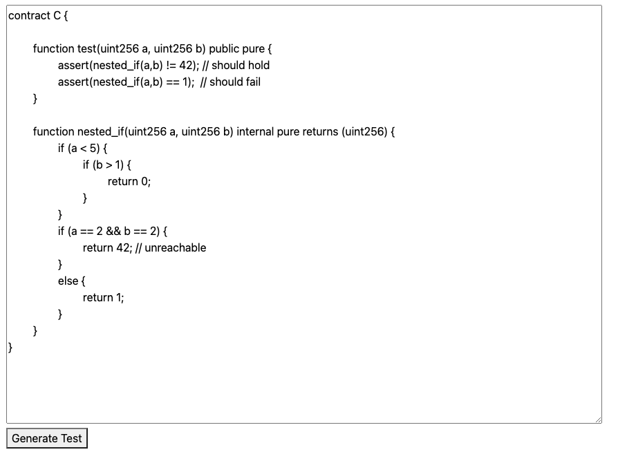
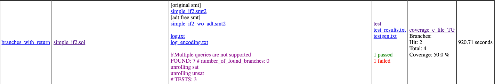

About
=====

The simplest Web Application to Run Scripts from https://github.com/izlatkin/solidity_testgen
and return html page as a result of test generation

Requirement 
============

* `JDK 1.8 or later` 
* for example `export JAVA_HOME=/Library/Java/JavaVirtualMachines/jdk-11.0.8.jdk/Contents/Home`
* `Gradle 4`
* `IDE IntelliJ community edition or professional edition`

Run
===

`./gradlew bootRun` or from IDE's run command (Grandle task)

Checks
=====
Post message
* `http://localhost:80`

HowTo 
=====
Insert smart contract and press "Generate Test" 

Result should be as a html report

